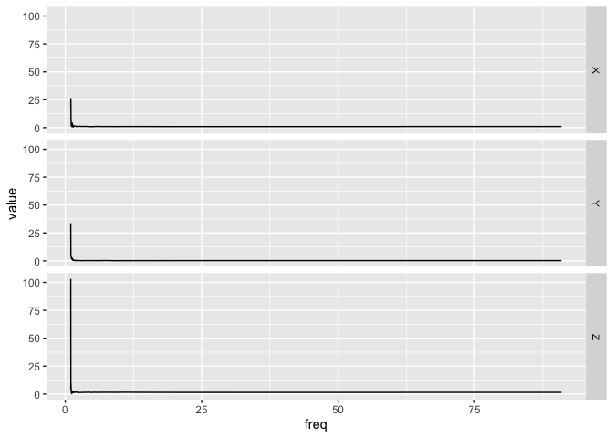

<!-- README.md is generated from README.Rmd. Please edit that file -->

# bis620.2022

<!-- badges: start -->

[](https://github.com/BlairZhang000802/bis620.2022/actions/workflows/R-CMD-check.yaml)
[](https://github.com/BlairZhang000802/bis620.2022/actions/workflows/test-coverage.yaml)
[](https://github.com/BlairZhang000802/bis620.2022/actions/workflows/lint.yaml)
[](https://app.codecov.io/gh/BlairZhang000802/bis620.2022?branch=main)
<!-- badges: end -->

The goal of bis620.2022 is to 1. compute frequency and spectral
signature of accelerometry data by using Fast Fourier Transformation 2.
plot time series data based on accelerometry data with time range or
frequency columns

## Installation

You can install the development version of bis620.2022 from
[GitHub](https://github.com/) with:

``` r
# install.packages("devtools")
devtools::install_github("BlairZhang000802/bis620.2022")
```

## Example

This is a basic example which shows you how to solve a common problem:

``` r
library(bis620.2022)
## basic example code
## import dataset ukb_accel
data(ukb_accel)
## compute frequency and spectral signature of the first 100 rows of ukb_accel
ukb_accel[1:100, ] |>
      spectral_signature()
#> # A tibble: 50 × 4
#>         X     Y       Z  freq
#>     <dbl> <dbl>   <dbl> <dbl>
#>  1 19.8   33.7  103.     1.01
#>  2 26.0    4.23   4.18   1.03
#>  3  8.14   4.23   9.58   1.05
#>  4  7.50   3.91   4.86   1.08
#>  5  1.55   2.74   2.73   1.10
#>  6  4.32   2.09   0.820  1.12
#>  7  2.61   2.62   2.85   1.15
#>  8  3.87   2.88   2.55   1.18
#>  9  3.63   2.90   0.237  1.20
#> 10  0.862  2.60   2.82   1.23
#> # … with 40 more rows
## you may also take log against frequency for different use if necessary
ukb_accel[1:100, ] |>
      spectral_signature(take_log = TRUE)
#> # A tibble: 50 × 4
#>         X     Y      Z  freq
#>     <dbl> <dbl>  <dbl> <dbl>
#>  1  2.98  3.52   4.64   1.01
#>  2  3.26  1.44   1.43   1.03
#>  3  2.10  1.44   2.26   1.05
#>  4  2.01  1.36   1.58   1.08
#>  5  0.438 1.01   1.01   1.10
#>  6  1.46  0.737 -0.199  1.12
#>  7  0.961 0.962  1.05   1.15
#>  8  1.35  1.06   0.935  1.18
#>  9  1.29  1.06  -1.44   1.20
#> 10 -0.148 0.957  1.04   1.23
#> # … with 40 more rows
```

``` r
## plot the first 100 rows' value against time of ukb_accel
ukb_accel[1:100, ] |>
  accel_plot()
```


``` r
## plot the spectural signature of the first 100 rows' value
##  against frequency of ukb_accel
ukb_accel[1:100, ] |>
      spectral_signature() |>
      accel_plot()
```



``` r
## plot the spectural signature of the first 100 rows' value
##  against log(frequency) of ukb_accel for better observation
ukb_accel[1:100, ] |>
      spectral_signature(take_log = TRUE) |>
      accel_plot()
```


